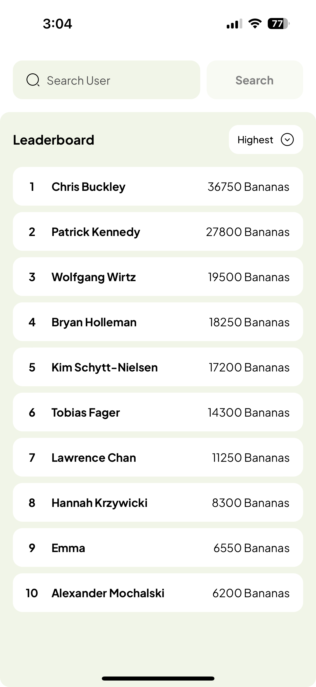
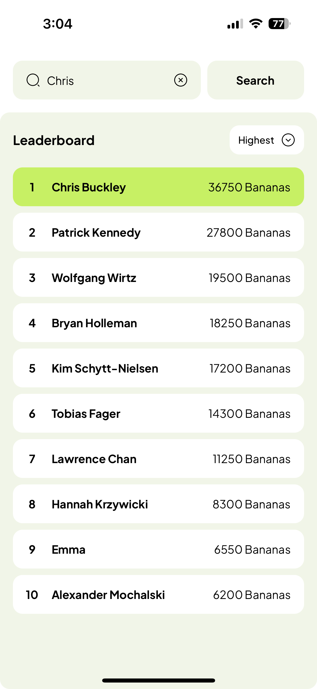
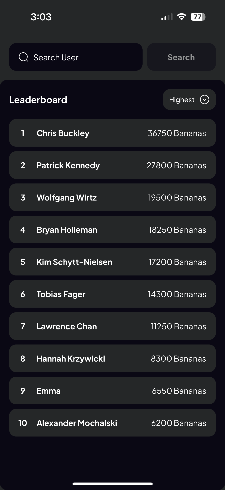
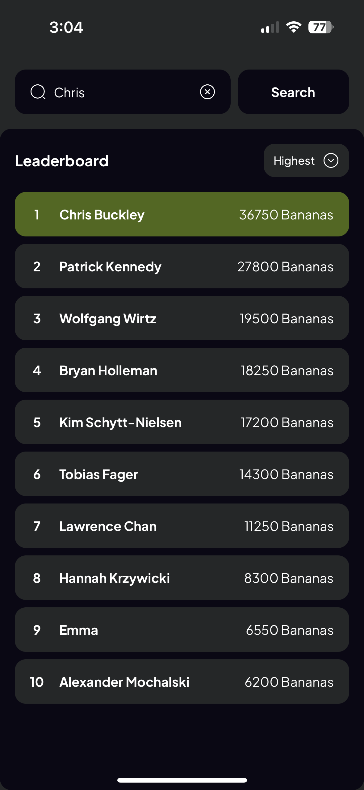

# Leaderboard

Assessment to make a Leaderboard App

## Requirements

- React Native
- TypeScript
- State Management (React Redux)
- Unit Test (Jest)

## Screenshots

Light Mode
<table>
  <tr>
    <td></td>
    <td></td>
  </tr>
 </table>

Dark Mode
 <table>
  <tr>
    <td></td>
    <td></td>
  </tr>
 </table>

## Unit Test

Script: `npm run test`